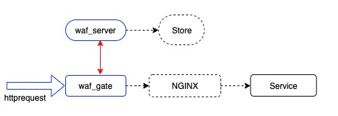
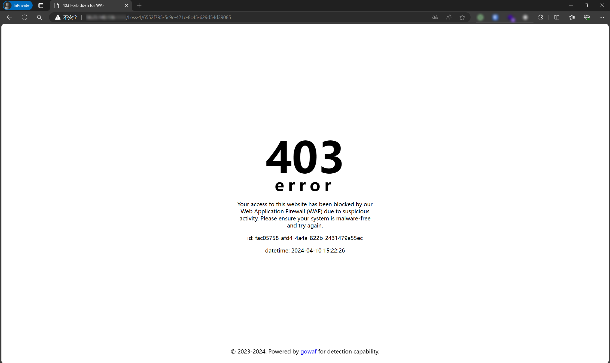
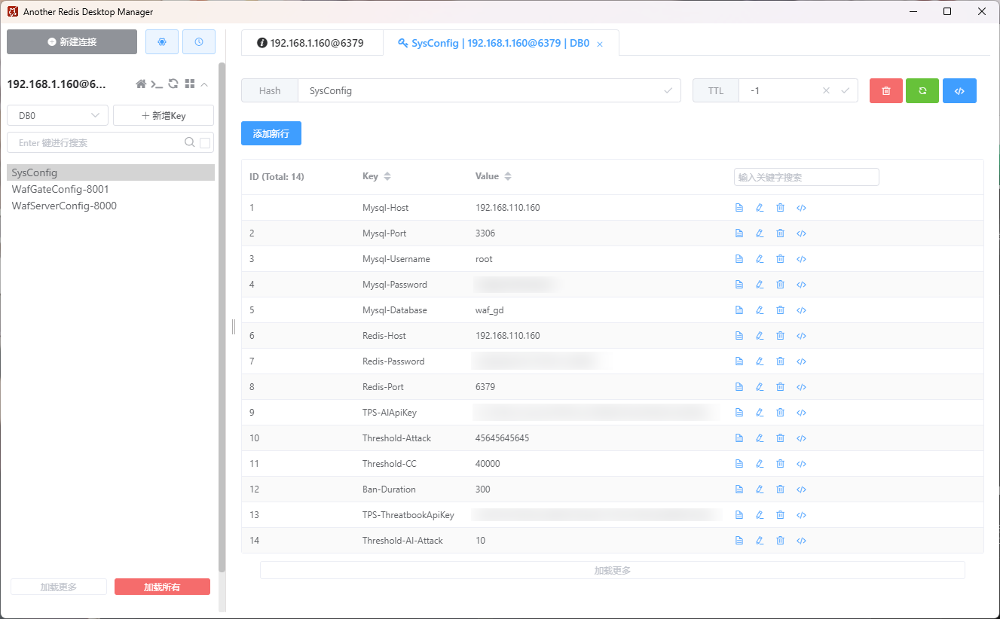

<!--
 * @Descripttion: 
 * @version: 
 * @Author: Ryan Zhang (gitHub.com/hz157)
 * @Date: 2024-05-19 23:59:19
 * @LastEditors: Ryan Zhang
 * @LastEditTime: 2024-05-20 00:06:55
-->
# GoWAF - Go-Powered Web Application Firewall (WAF)

GoWAF is a web application firewall developed in Go, featuring HTTP/HTTPS reverse proxy capabilities. It consists of two main components: `waf-gate`, a gateway, and `waf-server`, a server that performs detection tasks, designed to provide comprehensive security for web applications.

This project is an extension of https://github.com/kumustone/waf, incorporating database support for rule storage, enhanced threat detection, and the integration of large language models (LLM) for more accurate threat judgments.

## Key Features

- **Data Storage**: Implements rule storage using databases, supporting real-time modifications.
- **Response Interface**: Customizable interception response pages to improve user experience.
- **Attack Traceback**: Records and analyzes attack behaviors, facilitating source tracking.
- **Threat Intelligence**: Integrates threat intelligence to update threat data in real-time.
- **AI Detection**: Employs large language models (LLM) for in-depth threat analysis.

## Architecture Overview

GoWAF's architecture includes the `waf-gate` gateway and the `waf-server` server, detailing their cooperative work to provide security protection.

### Architecture Flow Diagram



### Interception Demonstration



## Environment Requirements

- MySQL
- Redis
- Go Language Environment

## Configuration and Launch

### Database support
1. MySQL database needs to be imported. The file is in [db/mysql_waf.sql](./db/mysql_waf.sql)
2. In the Redis database db0, the key value SysConfig is required, and the corresponding data is as follows<br>
**Tips: [2024-05-20] SysConfig Hash adds AI Type field for LLM model selection**


### waf-server Configuration

```toml
[Server]
# WafServer listening address
WafServerAddress = "127.0.0.1:8000"

# WafServer API address
HttpAPIAddress = "127.0.0.1:8001"

# Server ID for Redis data identification
ServerId = ""

[Redis]
Host = ""
Port = ""
Password  = ""
```

### waf-gate Configuration

```toml
[Gate]
# Gateway ID for fetching configurations from Redis
GateId = ""

[Redis]
Host = ""
Port = ""
Password  = ""
```

## Usage Guide

You have two options for running GoWAF: you can either download the executable directly or clone this repository and compile it yourself using Go.

### Getting Started

1. **Download Executable**: If available, you can download the pre-compiled `.exe` files for `waf-server` and `waf-gate` and run them directly on your system.

2. **Clone and Compile**:
    - Clone this repository to your local machine.
    - Navigate to the cloned directory.
    - Compile and run using Go. You can use `go run` for immediate execution or `go build` to create an executable.

### Running GoWAF

It's important to start `waf-server` before `waf-gate`. If `waf-server` is not running, `waf-gate` will pass all traffic without any filtering. You can deploy multiple instances of `waf-gate` for scalability or redundancy. For organizational purposes, it's recommended to place compiled `waf-server` or `waf-gate` files in separate directories.

**Start the WAF Server:**
```bash
go run waf-server.go
```

**Start the WAF Gate:**
```bash
go run waf-gate.go
```

This setup allows for a flexible deployment, catering to different operational environments and scalability needs.