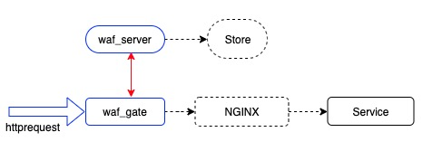
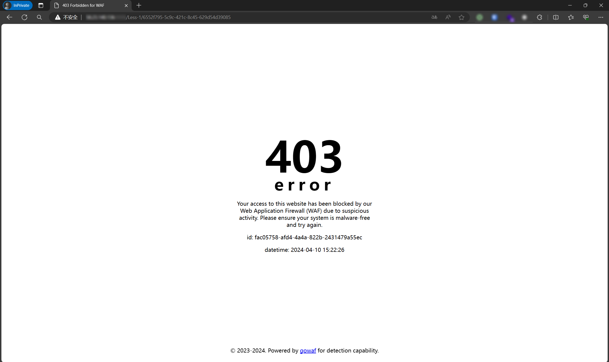

# GoWAF - 由Go语言驱动的Web应用防火墙(WAF)

GoWAF是一个基于Go语言开发的、包含HTTP/HTTPS反向代理功能的Web应用防火墙。它由两部分组成：`waf-gate`网关和`waf-server`服务器，旨在为Web应用提供全面的安全防护。

此项目是在 https://github.com/kumustone/waf 的基础上二次开发的，引入了数据库支持、增强的威胁检测、以及使用大型语言模型(LLM)进行更精准的威胁判断。

## 主要特性

- **数据存储**：使用数据库实现规则存储，支持实时变更。
- **响应界面**：定制化拦截响应页面，提升用户体验。
- **攻击回溯**：记录并分析攻击行为，方便追踪源头。
- **威胁情报**：集成威胁情报，实时更新威胁数据。
- **AI检测**：利用大型语言模型(LLM)进行深度威胁分析。

## 架构概览

GoWAF架构包括`waf-gate`网关和`waf-server`服务器两大部分，以及他们如何协同工作以提供安全防护。

### 架构流程图



### 拦截展示



## 环境要求

- MySQL
- Redis
- Go语言环境

## 配置与启动

### waf-server 配置

```toml
[Server]
# WafServer监听地址
WafServerAddress = "127.0.0.1:8000"

# WafServer接口地址
HttpAPIAddress = "127.0.0.1:8001"

# 服务端ID，用于标识Redis中的数据
ServerId = ""

[Redis]
Host = ""
Port = ""
Password  = ""
```

### waf-gate 配置

```toml
[Gate]
# 网关ID，用于从Redis读取配置
GateId = ""

[Redis]
Host = ""
Port = ""
Password  = ""
```

## 使用教程

您有两种方式运行GoWAF：可以直接下载可执行文件运行，也可以克隆本仓库后使用Go进行编译运行。

### 开始使用

1. **下载可执行文件**：如果可以，您可以下载`waf-server`和`waf-gate`的预编译`.exe`文件，直接在系统上运行。

2. **克隆并编译**：
    - 克隆本仓库到您的本地机器。
    - 导航到克隆的目录中。
    - 使用Go编译并运行。您可以使用`go run`来直接执行，或使用`go build`来创建一个可执行文件。

### 运行GoWAF

重要的是要先启动`waf-server`，再启动`waf-gate`。如果`waf-server`未运行，`waf-gate`将放行所有流量，不进行任何过滤。您可以部署多个`waf-gate`实例，以实现可扩展性或冗余。出于组织目的，建议将编译后的`waf-server`或`waf-gate`文件放置在单独的目录中运行。

**启动WAF服务器：**
```bash
go run waf-server.go
```

**启动WAF网关：**
```bash
go run waf-gate.go
```

此设置提供了灵活的部署方式，满足不同的操作环境和可扩展性需求。